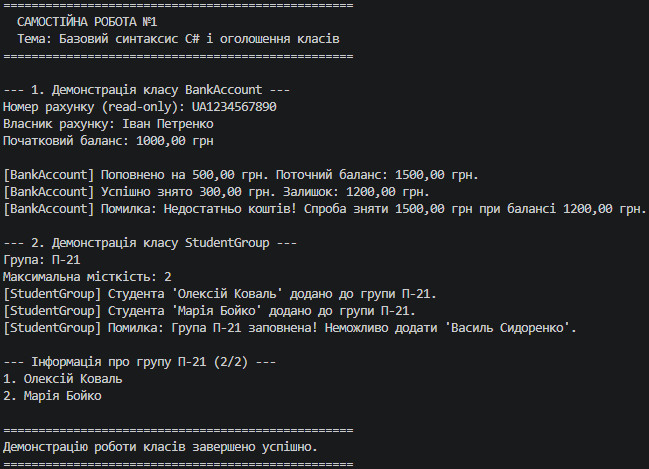

# Самостійна робота №1: Базовий синтаксис C# і оголошення класів

## Опис проєкту
Проєкт `IndependentWork1` демонструє навички оголошення класів, використання інкапсуляції, властивостей (зокрема read-only), конструкторів та методів з бізнес-логікою у мові C#.

## Реалізовані класи
1. **BankAccount** (Банківський рахунок):
   - Приватні поля: `_accountNumber`, `_ownerName`, `_balance`.
   - Властивості: `AccountNumber` (read-only), `OwnerName` (get/set), `Balance` (read-only).
   - Методи: `Deposit(decimal amount)`, `Withdraw(decimal amount)` (перевіряє наявність коштів на балансі).

2. **StudentGroup** (Навчальна група):
   - Приватні поля: `_groupName`, `_maxCapacity`, `_students`.
   - Властивості: `GroupName` (read-only), `MaxCapacity` (get/set), `StudentCount` (read-only).
   - Методи: `AddStudent(string studentName)` (перевіряє наповненість групи), `PrintGroupInfo()`.

## Висновок
Під час виконання самостійної роботи було закріплено практичні навички створення класів C#, застосування інкапсуляції за допомогою приватних полів та публічних властивостей, передачі даних через конструктори та реалізації логіки роботи з об'єктами.

