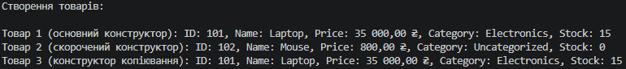

# Самостійна робота №2: Перевантаження конструкторів: приклади та сценарії

## Опис проєкту
Проєкт `IndependentWork2` присвячений практичному застосуванню перевантаження конструкторів у мові C# на прикладі класу `Product` для інтернет-магазину.

## Структура класу Product
- **Приватні поля**: `_id`, `_name`, `_price`, `_category`, `_stockCount`.
- **Публічні read-only властивості**: `Id`, `Name`, `Price`, `Category`, `StockCount`.
- **Конструктори**:
  1. Основний: ініціалізує всі 5 полів.
  2. Скорочений: приймає `id`, `name`, `price` та делегує виклик основному через `: this(id, name, price, "Uncategorized", 0)`.
  3. Копіювання: приймає екземпляр `Product` та делегує виклик основному через `: this(other.Id, other.Name, ...)`.
- **Метод ToString()**: перевизначений для зручного виводу повної інформації про товар.

## Висновок
У ході виконання роботи було опановано механізм делегування конструкторів за допомогою ключового слова `this`, навченося створювати read-only властивості та перевизначати метод `ToString()` для логування та форматованого виводу даних.

