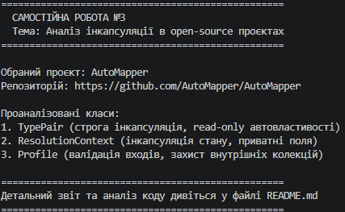

# Звіт з аналізу інкапсуляції в Open-Source проєкті

## 1. Обраний проєкт
- **Назва:** AutoMapper (популярна Object-Object Mapping бібліотека для .NET)
- **Посилання на GitHub:** [https://github.com/AutoMapper/AutoMapper](https://github.com/AutoMapper/AutoMapper)
- **Посилання на аналізовані класи:**
  - `TypePair`: [src/AutoMapper/TypePair.cs](https://github.com/AutoMapper/AutoMapper/blob/master/src/AutoMapper/TypePair.cs)
  - `ResolutionContext`: [src/AutoMapper/ResolutionContext.cs](https://github.com/AutoMapper/AutoMapper/blob/master/src/AutoMapper/ResolutionContext.cs)
  - `Profile`: [src/AutoMapper/Profile.cs](https://github.com/AutoMapper/AutoMapper/blob/master/src/AutoMapper/Profile.cs)

---

## 2. Аналіз інкапсуляції

### Клас 1: TypePair
- **Опис класу:** Представляє пару типів C# (типу-джерела SourceType та типу-призначення DestinationType), яка використовується як ключ у кеші відображень.
- **Поля:** Поля є readonly та інкапсульовані через автовластивості.
- **Властивості:** 
  - SourceType та DestinationType реалізовані як get-only автовластивості (`public Type SourceType { get; }`). Це гарантує незмінність (immutability) екземпляра після створення.
```csharp
public readonly struct TypePair : IEquatable<TypePair>
{
    public Type SourceType { get; }
    public Type DestinationType { get; }

    public TypePair(Type sourceType, Type destinationType)
    {
        SourceType = sourceType;
        DestinationType = destinationType;
    }
}
```
