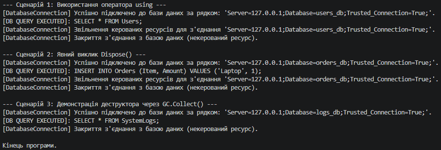

# Лабораторна робота №3: Життєвий цикл об’єкта та керування ресурсами

##  Опис проєкту
Цей консольний проєкт реалізує лабораторну роботу з дисципліни **«Об'єктно-орієнтоване програмування»**. Основна мета роботи — вивчення життєвого циклу об’єктів у .NET, робота з некерованими ресурсами, реалізація інтерфейсу `IDisposable` та класичного патерну `Dispose`.

* **Варіант:** №2 (`DatabaseConnection`)
* **Студент:** Рівненський фаховий коледж інформаційних технологій (РФКІТ)

---

##  Реалізований функціонал (Варіант 2)
У проєкті створено клас `DatabaseConnection`, який імітує з'єднання з базою даних і містить:
1. Приватні поля `_disposed`, `_connectionString` та `_isConnected`.
2. Конструктор, який «виділяє ресурс» (встановлює з'єднання).
3. Метод `ExecuteQuery(string query)` для виконання запитів (з перевіркою стану об'єкта).
4. Повний паттерн `Dispose`:
   - Публічний метод `Dispose()`, який викликає `Dispose(true)` та `GC.SuppressFinalize(this)`.
   - Захищений віртуальний метод `Dispose(bool disposing)` для поетапного звільнення керованих та некерованих ресурсів.
   - Деструктор (фіналізатор) `~DatabaseConnection()`, який викликає `Dispose(false)`.

---

##  Демонстрація сценаріїв у `Main`
У програмі продемонстровано 3 сценарії життєвого циклу та закриття ресурсу:
1. **Оператор `using` (`using var ...`)** — автоматичне вивільнення ресурсу при виході з блоку видимості.
2. **Явний виклик `Dispose()`** — самостійне закриття з'єднання програмістом до завершення життєвого циклу області видимості.
3. **Робота деструктора через `GC.Collect()`** — імітація ситуації, коли метод `Dispose()` не викликався явно, і ресурс закривається фоновим збирачем сміття через фіналізатор.

---

##  Як запустити проєкт

1. Відкрийте термінал у папці з проєктом (`lab3v2`).
2. Запустіть програму за допомогою .NET SDK:
   ```bash
   dotnet run


