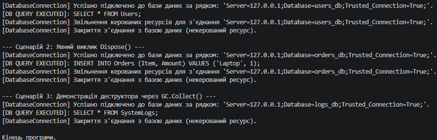

# Лабораторна робота №4: Властивості та статичні члени. Індексатори й перевантаження операторів

##  Опис проєкту
Цей консольний проєкт реалізує лабораторну роботу з дисципліни **«Об'єктно-орієнтоване програмування»**. Головна мета — навчитися застосовувати інкапсуляцію через властивості з валідацією, використовувати статичні члени, реалізовувати індексатори та перевантажувати оператори в C#.

* **Варіант:** №2 (`Fraction` / Дріб)
* **Студент:** Рівненський фаховий коледж інформаційних технологій (РФКІТ)

---

##  Реалізований функціонал (Варіант 2)
У класі `Fraction` реалізовано:
1. **Приватні поля:** `_numerator`, `_denominator`.
2. **Властивості з валідацією:** `Numerator` та `Denominator` (сеттер знаменника генерує виняток `ArgumentException`, якщо значення дорівнює `0`).
3. **Статичний член:** Властивість `One`, яка повертає готовий об'єкт `Fraction(1, 1)`.
4. **Індексатор (`this[int index]`):** Дозволяє звертатися до чисельника (`index = 0`) та знаменника (`index = 1`) за індексом.
5. **Перевантажені оператори:** `+`, `*`, `==`, `!=`.
6. **Методи:** Перевизначені `ToString()`, `Equals()`, `GetHashCode()`.

---

##  Як запустити проєкт

1. Відкрийте термінал у папці з проєктом (`lab4v2`).
2. Запустіть застосунок за допомогою .NET SDK:
   ```bash
   dotnet run

 
