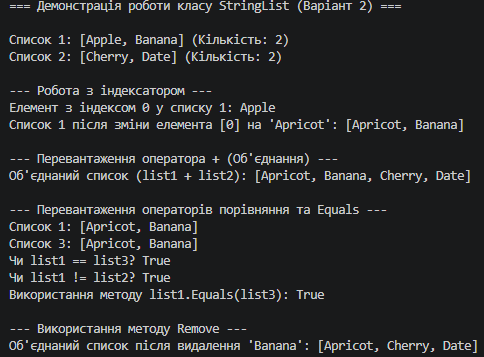

# Лабораторна робота №5: Індексатори та перевантаження операторів

##  Опис проєкту
Цей консольний проєкт реалізує лабораторну роботу з дисципліни **«Об'єктно-орієнтоване програмування»**. Головна мета — навчитися створювати власні індексатори для зручного доступу до елементів колекції за індексом, а також розширювати функціональність класів за допомогою перевантаження операторів у C#.

* **Варіант:** №2 (`StringList` / Список рядків)
* **Студент:** Рівненський фаховий коледж інформаційних технологій (РФКІТ)

---

##  Реалізований функціонал (Варіант 2)
У класі `StringList` реалізовано:
1. **Приватне поле:** `List<string> _items` для зберігання рядків.
2. **Індексатор (`this[int index]`):** Забезпечує безпечне читання та запис елементів за індексом із перевіркою виходу за межі.
3. **Перевантажені оператори:** 
   - `+` — об'єднання двох списків рядків в один новий список.
   - `==` та `!=` — порівняння списків за їхнім вмістом (`SequenceEqual`).
4. **Методи та властивості:** `Count`, `Add()`, `Remove()`, а також обов'язково перевизначені `ToString()`, `Equals()` та `GetHashCode()`.

---

##  Як запустити проєкт

1. Відкрийте термінал у папці з проєктом (`lab5v2`).
2. Запустіть застосунок за допомогою .NET SDK:
   ```bash
   dotnet run


