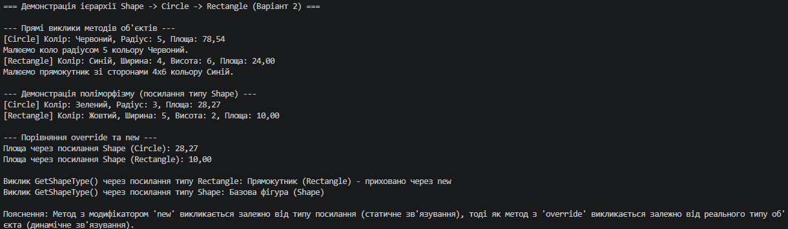

# Лабораторна робота №6: Наслідування. Ключові слова base, override, virtual. Приховування членів (new)

##  Опис проєкту
Цей консольний проєкт реалізує лабораторну роботу з дисципліни **«Об'єктно-орієнтоване програмування»**. Мета роботи полягає у вивченні механізму наслідування, реалізації поліморфізму за допомогою ключових слів `virtual` та `override`, виклику конструкторів через `base`, а також розумінні різниці між `override` та приховуванням членів за допомогою `new`.

* **Варіант:** №2 (`Shape → Circle → Rectangle`)
* **Студент:** Рівненський фаховий коледж інформаційних технологій (РФКІТ)

---

##  Реалізована ієрархія (Варіант 2)
1. **Базовий клас `Shape`:**
   - Поле/властивість: `Color`.
   - Віртуальний метод: `GetArea()` та `DisplayInfo()`.
   - Метод `GetShapeType()`.
2. **Похідний клас `Circle`:**
   - Успадковує `Shape`, додає поле `Radius`.
   - Викликає конструктор базового класу через `base(color)`.
   - Перевизначає метод `GetArea()` за допомогою `override`.
   - Має власний унікальний метод `Draw()`.
3. **Похідний клас `Rectangle`:**
   - Успадковує `Shape`, додає поля `Width` і `Height`.
   - Викликає конструктор базового класу через `base(color)`.
   - Перевизначає метод `GetArea()` за допомогою `override`.
   - Демонструє приховування методу за допомогою модифікатора `new` (`GetShapeType()`).
   - Має власний метод `Draw()`.

---

##  Як запустити проєкт

1. Відкрийте термінал у папці з проєктом (`lab6v2`).
2. Запустіть застосунок за допомогою .NET SDK:
   ```bash
   dotnet run


