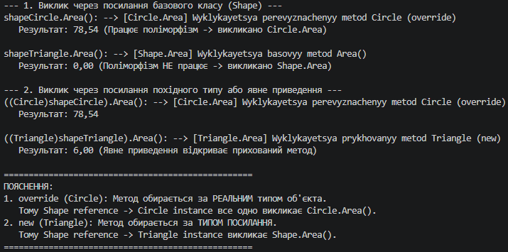

## Висновок

Під час виконання лабораторної роботи №7 було досліджено відмінності між перевизначенням методів за допомогою ключового слова override та їх приховуванням за допомогою модифікатора new у мові програмування C# (.NET SDK).

На прикладі ієрархії класів Shape -> Circle / Triangle (Варіант 2) було практично продемонстровано:

1. Перевизначення (override):
   - Забезпечує динамічний поліморфізм та пізнє зв'язування (рантайм).
   - При виклику методу через посилання базового типу `Shape shapeCircle = new Circle(...)` виконується саме перевизначений метод `Circle.Area()`.
   - Є основним підходом при побудові ООП-ієрархій, де необхідна однакова поведінка через спільний інтерфейс.

2. Приховування (new):
   - Забезпечує статичне зв'язування під час компіляції.
   - При виклику методу через посилання базового типу `Shape shapeTriangle = new Triangle(...)` виконується метод базового класу `Shape.Area()`.
   - Виклик прихованого методу `Triangle.Area()` можливий лише при використанні посилання типу Triangle або за допомогою явного приведення типів (`((Triangle)shapeTriangle).Area()`).
   - Використовується рідко, переважно для розмежування логіки, коли метод базового класу не є віртуальним або при конфліктах імен у сторонніх бібліотеках.

У результаті виконання роботи набуто практичних навичок аналізу типу посилання та реального типу об'єкта в пам'яті, створення базових та похідних класів у C#, а також правильного вибору між override та new залежно від поставлених архітектурних завдань.

