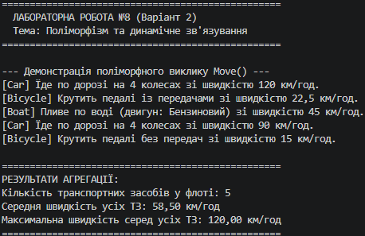

## Висновок

Під час виконання лабораторної роботи №8 було досліджено та практично застосовано концепцію поліморфізму та динамічного зв'язування в мові програмування C# (.NET SDK).

На прикладі ієрархії класів Vehicle -> Car, Bicycle, Boat (Варіант 2) було реалізовано:
1. Базовий клас Vehicle з віртуальним методом Move() та властивістю Speed.
2. Похідні класи Car, Bicycle та Boat, які перевизначають метод Move() відповідно до специфіки свого руху.
3. Колекцію List<Vehicle>, яка містить екземпляри всіх похідних типів.

У результаті виконання програми продемонстровано, що виклик віртуального методу у циклі foreach виконує саме ту реалізацію, яка відповідає фактичному типу об'єкта в пам'яті (динамічне зв'язування). Також успішно виконано агрегацію даних — обчислено середню та максимальну швидкість усіх транспортних засобів у колекції.

Робота підтвердила переваги поліморфізму для створення гнучкого, розширюваного та легко підтримуваного коду.

